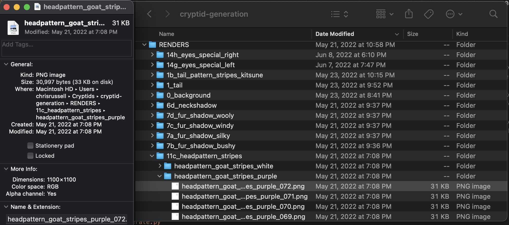

## File setup
Each Cryptid is constructed by layering multiple traits on a sinle frame, then iterating through all 72 frames to build a 3-second loop at 24 frames/second. Each trait is composed of 72 frames (1100x1100), exported from After Effects, with transparency. 

We did build our own tooling so only a single color would need to be exported from After Effects, then a script would geneate the othe 8 colors. We also decided mid-project to increase the size of the borders, leading to a final frame size of 1180x1180. This allowed us the space necessary to generate profile pictures as well as full-frame shots. 

## Naming convention
Every folder and file share the same descriptor. This allows the program to locate the folder and file directory using a single keyword.   

ex.) folder = `eyes_beast_pupil_right`, frames = `eyes_beast_pupil_right_00X.png`



## JSON Trait Structure
Every trait (attribute) has a category and color. Trait rarity ranges between 0 to 1 and category/color rarity are determined by the sum of that group's weight. THis setup allows continuous refinement/integration of art assets as you build your project. 

ex.) Snippit from `trait_manifest.json`
```json
{
    "attribute": "14e_eyes_iris_right",
    "rarity": 1,
    "categories": [
        {
            "category": "beast",
            "weight": 1,
            "colors": [
                {
                    "color": "green",
                    "weight": 1,
                    "traits": [
                        {
                            "trait": "eyes_beast_iris_right_green",
                            "weight": 1
                        }
                    ]
                },
                {
                    "color": "orange",
                    "weight": 1,
                    "traits": [
                        {
                            "trait": "eyes_beast_iris_right_orange",
                            "weight": 1
                        }
                    ]
                },
            ]
        }
    ]
}
```


## Methodology
1. `trait_manifest.json`, `color_manifest.json`, and  `background_manifest.json` determine the rarity and occurence of traits that form a single Cryptid.
2. Our files are 72 rendered frames (3 second animation), using the same naming convention for the folder and file. For example, `eyes_beast_pupil_right` folder contains 72 files of `eyes_beast_pupil_right_00X.png`.
3. `generate.py` kicks off the automation with multiprocessing, recording the hashed dictionary of attributes to keep prevent duplicate Cryptids.
4. `dna.py` returns the metadata and list of trait file paths for the cryptids, to be used by `render_assets.py` for art generation (mp4, png, gif). At the end of this process, the dna is compared to `incompatible.py` to prevent clashing colors/attributes ex.) dark cryptid on a dark background.
5. `traits.py` contain all of the getter functions - which each chose the next layer of the cryptid based on complete chance, or input from another trait. 
6. `combine.py` layers all of the frames together, savings frames for transparent still images and pfp headshots. Both transparent and solid background animations were generated. 
7. `render_assets.py` combines the frames into multiple file formats using ffmpeg.


## Repo Installation Instructions
1. Clone repo into folder
2. pip install -r requirements.txt  

## Generate Cryptids 
1. Select number of frames and processes in `generate.py`
2. Run `generate.py`
3. Create assets with `render_assets.py`   


## Pin folder to IPFS Example  
```
ipfs add --recursive --progress ./gif  
```    